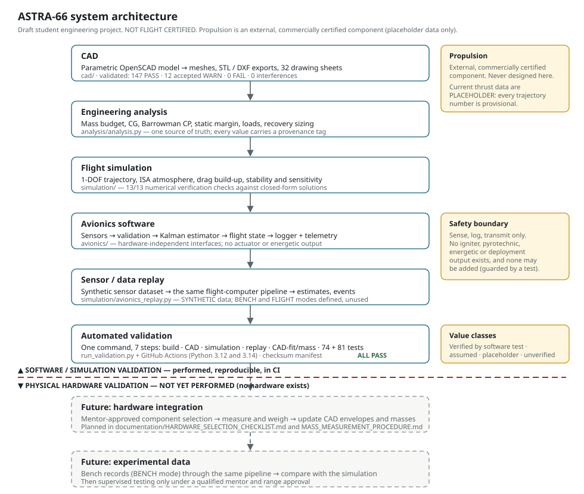
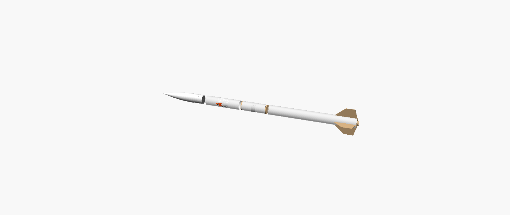
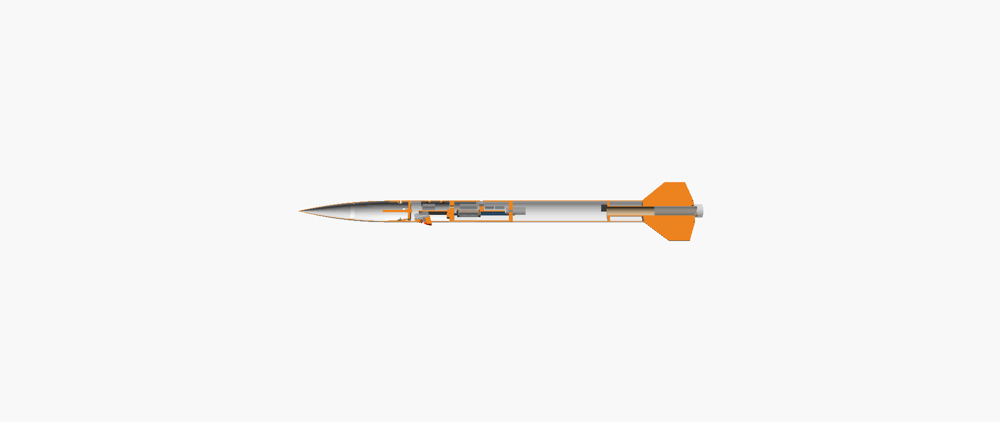
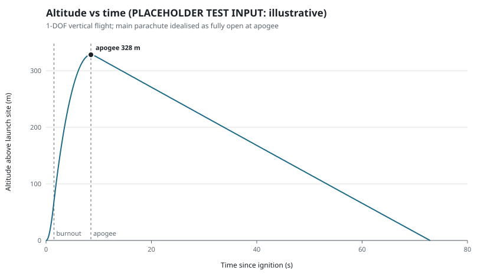
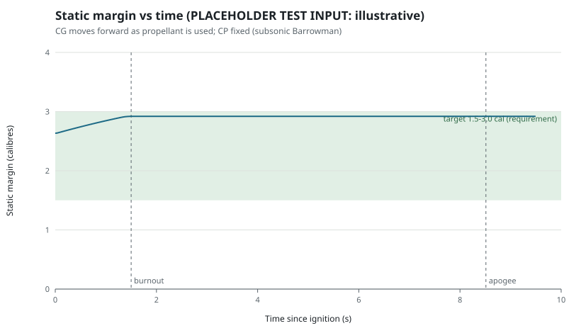

<div align="center">

# ASTRA-66

### Parametric rocket airframe · engineering analysis · flight simulation · data-only avionics framework

**A 66 mm-class student rocket airframe designed, analysed, simulated and software-validated end to end — reproducible with one command.**

[](https://github.com/Aarya801/ASTRA-66/actions/workflows/validation.yml)
[](documentation/REPRODUCIBILITY.md)
[](requirements.txt)
[](documentation/VALIDATION.md)
[](documentation/CAD_VALIDATION.md)
[](#safety-status)
[](LICENSE)


</div>

> [!IMPORTANT]
> **ASTRA-66 is an educational engineering project and is NOT FLIGHT CERTIFIED.**
> Nothing has been built or flown. No avionics hardware has been selected, bought, weighed or tested, and every
> avionics dataset is synthetic. Propulsion is an external, commercially certified component that is never designed,
> modified or specified here, and its data are placeholders. Any launch would require review and sign-off by a
> qualified rocketry mentor or institution and the range safety officer.

---

## What is ASTRA-66?

ASTRA-66 is a 66 mm-class, 1144 mm modular rocket airframe built as a **complete engineering pipeline** rather than a
drawing exercise:

- one parameter file is the single source of truth;
- the CAD is generated from it and then **measured** — volumes, interferences, assembly feasibility, printability;
- the analysis consumes those measured meshes; the simulation consumes the analysis;
- a data-only avionics software framework is exercised against synthetic sensor data through the same code path a
  flight computer would run;
- and a single command re-validates all of it, in CI, on two Python versions.

The engineering problem is **consistency and honesty**: keeping CAD, analysis, simulation and software in agreement,
and labelling every number as verified, calculated, assumed, placeholder or unknown.

| | |
|---|---|
| **Vehicle class** | 66 mm diameter · 1144 mm length · 4 fins · single parachute |
| **Modules** | Nose · payload bay · avionics bay · booster (all separable) |
| **Avionics** | Sense, log, transmit only — no actuation of any kind |
| **Propulsion** | External, commercially certified component (placeholder data only) |
| **Codebase** | 67 Python files (~10 200 lines) · 30 OpenSCAD files (~950 lines) · standard library only |
| **Artefacts** | 282 tracked files: CAD exports, drawings, plots, datasets, 37 documents |

📖 **Start here:** [Project overview](documentation/PROJECT_OVERVIEW.md) ·
[Engineering method](documentation/ENGINEERING_METHOD.md) · [What is validated](documentation/VALIDATION.md) ·
[Release readiness](documentation/RELEASE_READINESS.md)

---

## System architecture

<div align="center">

</div>

Everything above the red line is performed, reproducible and runs in CI. Everything below it — hardware integration
and experimental data — **has not been done**.

<details>
<summary><b>Data flow in text form</b></summary>

```
analysis/analysis.py ──► build.py ──► cad/astra66_params.scad ──► cad/build_cad.py (OpenSCAD, optional)
        │                    │                                          │
        │                    └► engineering package, BOM, drawings      └► CAD validation + CAD-derived masses
        ▼
simulation/flight_simulation.py ──► stability, sensitivity, verification, plots, reports
        ▲                                   │
simulation/motor_config.json (EXTERNAL,     └► simulation/avionics_replay.py ──► avionics/firmware
currently PLACEHOLDER)                                                           (the same pipeline a flight
                                                                                  computer would run)
```
</details>

---

## CAD

Parametric OpenSCAD model: **25 designed parts + master assembly**, driven by the generated parameter file.
Commercial items (motor envelope, retainer, rail buttons, eyebolt, electronics) appear only as **envelopes**.

<div align="center">

| Assembly | Exploded | Half-section |
|:---:|:---:|:---:|
|  |  |  |

</div>

| Asset | Content |
|---|---|
| `cad/exports/stl/` | 15 print-ready STLs, oriented, with documented support needs |
| `cad/exports/dxf/` | 8 DXF + 8 SVG laser/knife-cut profiles |
| [`cad/drawings/`](cad/drawings/index.html) | 31 drawing sheets generated from true mesh sections |
| [`documentation/drawings/`](documentation/drawings) | Engineering sheets A-001…A-007 |
| [`images/`](images) | Four renders produced by the CAD pipeline |

**Validation is measured on the rendered meshes**, not asserted: manifold geometry, 44 interference pairs
(0 interferences), 11 interface checks, assembly feasibility (sled removal, joint separation, fin removal with the
retainer fitted), printability and wall thickness — **147 PASS · 12 accepted WARN · 0 FAIL**
([report](documentation/CAD_VALIDATION.md)).

<details>
<summary><b>Manufacturing and bill of materials</b></summary>

- FDM-printed PETG and ASA parts (220 × 220 × 250 mm build volume is sufficient); ASA for the fin-can core near the motor.
- Laser-cut plywood bulkheads, rings and fins; purchased tube stock; metric fasteners and heat-set inserts.
- 11 printed parts need support in the documented pose; the hatch panel wall is 1.0 mm (0.25 mm nozzle recommended).
- BOM: **43 line items** (26 make, 15 buy, 2 EXTERNAL — the certified motor and igniter, never fabricated),
  17 fastener types, 10 stock materials.
- Planning cost, excluding motor, tools and shipping: **USD 232–437** (low-cost) · **292–636** (recommended).

</details>

---

## Engineering analysis

Mass budget, CG, Barrowman CP, static margin, structural loads and recovery sizing — all from the same parameters,
with structural masses derived from CAD-measured volumes.

| Result | Value | Class |
|---|---|---|
| Overall length / body OD / fin span | 1144 / 66 / 186 mm | verified from CAD |
| Liftoff mass / CG / CP | 1210.7 g / STA 696.4 mm / STA 870.3 mm | calculated |
| Static margin — liftoff / rail exit / burnout | 2.63 / 2.67 / 2.92 cal | calculated · **depends on placeholder motor data** |
| Avionics + payload subtotal | 262.7 g at STA 472.4 mm (21.7 % of liftoff mass) | calculated from assumed masses |

<details>
<summary><b>Value classes used throughout the project</b></summary>

| Class | Meaning | Examples |
|---|---|---|
| **A — verified from CAD** | Measured on the rendered meshes | lengths, volumes, clearances, interference |
| **B — calculated** | Derived from A, C and D | CG, CP, static margin, loads, descent rate |
| **C — assumption** | Engineering estimate, must be measured | densities, print fill, electronics masses, drag model |
| **D — placeholder** | Stand-in until real data exist | motor, retainer, camera, battery, switch envelopes |

"Verified" means verified against the CAD model or closed-form checks.
**No value has been verified by physical measurement or flight test.**

</details>

---

## Simulation

1-DOF vertical trajectory (RK4, ISA atmosphere, drag build-up), stability through the flight, a sensitivity study over
eight non-propulsion parameters, and **13 numerical verification checks** against closed-form solutions.

| Result — PLACEHOLDER motor, illustrative only | Value |
|---|---|
| Apogee | 328.2 m |
| Maximum speed / acceleration | 80.3 m/s · 7.4 g |
| Rail-exit speed | 11.7 m/s *(below the 15 m/s guideline — see limitations)* |
| Descent rate | 5.09 m/s |

<div align="center">


</div>

📄 [Simulation validation report](documentation/SIMULATION_VALIDATION.md) · [all plots](simulation/plots)

---

## Avionics software

A **data-only** flight-computer framework in standard-library Python, runnable without any hardware:

```
Sensor interface → schema validation → Kalman altitude/velocity estimator → flight-state classifier
                 → data logger (CSV/JSONL, CRC-16 per row) → telemetry packet v2 → ground station
```

| Capability | Detail |
|---|---|
| Sensor layer | Hardware-independent `Sensor` interface; simulated and replay sources; fault injection |
| Validation | Every value checked against the schema *before* processing; NaN, unparseable and out-of-range rejected and flagged |
| State estimation | 2-state Kalman filter (altitude, vertical velocity); barometer-only after apogee |
| Flight states | `PRELAUNCH → ASCENT → COAST → DESCENT → LANDED`, forward-only — **data labels that drive nothing** |
| Logging | Schema-conformant CSV / JSON-lines, CRC-16 per row, metadata sidecar, tolerant reader |
| Telemetry | 41-byte packet v2: sequence number, CRC-16, SIMULATED flag, per-sensor health bits |
| Ground station | Receiver with loss/duplicate/reject statistics, local server, browser dashboard (replay only) |
| Post-flight analysis | Tolerant log reader, six plot types, derived statistics, data-quality report |

<div align="center">

</div>

📄 [Avionics design](documentation/AVIONICS_DESIGN.md) · [architecture audit](documentation/AVIONICS_ARCHITECTURE.md) ·
[data format](avionics/DATA_FORMAT.md)

<details>
<summary><b>Data pipeline and synthetic datasets</b></summary>

| Dataset | Size | Mode |
|---|---|---|
| `avionics/data/example/example_flight_simulated.csv` | 4547 logged frames at 50 Hz | SYNTHETIC (legacy label `SIMULATED`) |
| `simulation/data/sample_flight.csv` | 2162 sensor-level rows with 5 scripted faults | SYNTHETIC |
| `avionics/bench_data/example_bench_record.csv` | 501-row column template for future bench records | SYNTHETIC — **not a measurement** |

Data-source modes are enforced in code: `SYNTHETIC`, `BENCH` and `FLIGHT`, where **`FLIGHT` is disabled** because no
flight record exists. Plots, reports and telemetry all carry the mode.

</details>

---

## Validation

[](https://github.com/Aarya801/ASTRA-66/actions/workflows/validation.yml)

```bash
python run_validation.py
```

| # | Step | Result |
|---|---|---|
| 1 | Engineering package build | ✅ PASS |
| 2 | CAD integration — 147 PASS · 12 accepted WARN · 0 FAIL | ✅ PASS |
| 3 | Flight simulation — 13/13 verification checks | ✅ PASS |
| 4 | Avionics sensor replay | ✅ PASS |
| 5 | CAD fit and mass properties — 11 PASS · 4 WARN · 8 UNVERIFIED · 0 FAIL | ✅ PASS |
| 6 | Project regression tests — 74 tests | ✅ PASS |
| 7 | Avionics software tests — 81 tests | ✅ PASS |
| | **Overall — 155 tests, 0 failures** | ✅ **PASS** |

The same command runs in GitHub Actions on **Python 3.12 and 3.14** for every push and pull request, and
`MANIFEST.sha256` checksums every tracked file.

📄 [What is and is not validated](documentation/VALIDATION.md) · [test plan](documentation/TEST_PLAN.md)

---

## Repository structure

```
ASTRA-66/
├── analysis/          analysis.py (single source of truth) + generated results
├── cad/               OpenSCAD sources, exports (STL/DXF), drawings, build pipeline
├── simulation/        flight simulation, sensor replay, datasets, results, plots
├── avionics/          firmware, ground station, analysis tool, schema, data, integration checks, tests
├── documentation/     engineering package, validation reports, portfolio documents, diagrams
├── bom/               bom.csv, fasteners.csv, materials.csv
├── tests/             project regression tests
├── images/            CAD renders
├── hosting/ + dist/   standalone engineering-package page
├── run_validation.py  the one command
└── MANIFEST.sha256    checksum of every tracked file
```

---

## Technology and tool stack

| Layer | Tool | Notes |
|---|---|---|
| Language | Python 3.12 / 3.14 | **Standard library only** — no third-party packages anywhere |
| CAD | OpenSCAD 2021.01 (CGAL) | Optional: needed only to re-render; exports are committed |
| Mesh analysis | Own pure-Python tools | STL read/write, volume and centroid, manifold checks, plane slicing, overhang |
| Numerics | Own implementations | RK4 integrator, ISA atmosphere, Barrowman CP, 2-state Kalman filter |
| Data formats | CSV / JSON / JSON-lines | Deterministic, schema-driven, CRC-16 per row |
| Drawings and plots | Own SVG generators | No plotting library; drawings built from true mesh sections |
| Web | Vanilla HTML + JS, `http.server` | Engineering package page; ground-station dashboard |
| Tests | `unittest` | 155 tests, hardware-free |
| CI | GitHub Actions | Matrix over two Python versions, artefact upload |
| Integrity | SHA-256 manifest | Every tracked file checksummed |

---

## Engineering workflow and milestones

The workflow the project follows (details: [engineering method](documentation/ENGINEERING_METHOD.md)):

```
requirements → CAD → analysis → simulation → validation → hardware integration → testing
     ✅          ✅       ✅          ✅           ✅              ⬜ not started       ⬜ not started
```

Milestones as recorded in this repository's git history:

| Commit | Date | Milestone |
|---|---|---|
| [`e503ef6`](https://github.com/Aarya801/ASTRA-66/commit/e503ef6) | 2026-09-19 | Initial engineering package: parameters, CAD rev B with validation, analysis, simulation, documentation, tests |
| [`4c8d193`](https://github.com/Aarya801/ASTRA-66/commit/4c8d193) | 2026-09-19 | CI validation badge |
| [`bc430a3`](https://github.com/Aarya801/ASTRA-66/commit/bc430a3) | 2026-09-20 | Avionics and flight-data framework: firmware, ground station, replay, integration checks, 7-step pipeline |

---

## Current status

| Area | Status |
|---|---|
| Software behaviour | ✅ Verified by 155 automated tests on synthetic data |
| CAD model | ✅ Validated against the rendered meshes (0 FAIL, 0 interferences) |
| Simulation code | ✅ Verified against closed-form solutions (13/13) |
| Trajectory numbers | ⚠️ **Illustrative** — placeholder propulsion data |
| Avionics hardware | ⛔ **Nothing selected, built, weighed or tested** |
| Physical fit and masses | ⛔ **Unverified** — 8 items need measurement |
| Flight behaviour, recovery, radio range | ⛔ **Never tested** |

📄 [Hardware-integration status](documentation/HARDWARE_INTEGRATION_STATUS.md) ·
[hardware integration](documentation/HARDWARE_INTEGRATION.md) · [roadmap](documentation/ROADMAP.md)

---

<a name="safety-status"></a>
## ⚠️ Safety status — NOT FLIGHT CERTIFIED

> [!WARNING]
> **ASTRA-66 is NOT FLIGHT CERTIFIED and has never flown.**

- **No propulsion work of any kind.** No motors, propellant, igniters, pyrotechnics or energetic devices are designed,
  modified, specified or described. The motor is an external, commercially certified product, selected and handled by
  a certified person; recovery uses that motor's own ejection, prepared by a mentor.
- **No actuation.** The avionics sense, log and transmit. There is no output that could drive an igniter or a
  deployment device, and a test fails the build if an actuation-style identifier or a hardware-I/O import appears.
- **No autonomous flight control.**
- **Radio only where legal:** any telemetry radio must use a band and power level legal where it is operated, with
  range frequency coordination.
- **Nothing is presented as measured.** Synthetic data and placeholders are labelled as such; the `FLIGHT` data mode
  is disabled in software until a genuine, mentor-reviewed flight record exists.

---

## Limitations and future experimental work

<details open>
<summary><b>Known limitations carried into this release</b></summary>

1. Propulsion data are placeholders: every trajectory value, and any margin including the motor, is provisional.
2. Rail-exit speed 11.7 m/s on the 1.0 m planning rail is below the 15 m/s guideline (placeholder input).
3. About 100 g extra in the payload bay pushes the static margin above 3.0 calibres (over-stable).
4. Four open CAD integration warnings: incomplete electronics envelopes; IMU placeholder 20.5 mm off the roll axis;
   steel rods beside the radio envelope; 0.40 mm sled-removal margin.
5. Twelve accepted CAD warnings: 11 printed parts need support; the hatch wall is 1.0 mm.
6. Barometric altitude is biased above an elevated pad (≈1.1 % at 500 m); the planning site is at 0 m.
7. Thresholds, filter tuning and sensor requirements are assumptions checked only on synthetic data.
8. Uncalibrated drag model; 1-DOF flight model (no wind, weathercocking or dynamic stability).
9. Structures: hand calculations with conservative allowables; no FEA, no coupon tests.

</details>

**Future experimental work**, in order and none of it started: mentor-approved component selection → measure and weigh
the parts → update the CAD envelopes and mass budget → bench tests B-01…B-14 → record real sensor data and compare it
with the simulation → certified motor data → supervised testing only with a mentor and range approval.

📄 [Roadmap](documentation/ROADMAP.md) · [bench-test plan](documentation/AVIONICS_BENCH_TEST_PLAN.md) ·
[selection checklist](documentation/HARDWARE_SELECTION_CHECKLIST.md)

---

## Setup and reproducibility

**Requirements:** Python 3.12 or newer. Nothing to install — standard library only.

```bash
git clone https://github.com/Aarya801/ASTRA-66.git
cd ASTRA-66
python run_validation.py
```

Expected ending: `OVERALL: PASS` (exit code 0) with the seven steps above.

<details>
<summary><b>Other commands</b></summary>

```bash
python -m unittest discover -s tests                 # project regression tests (74)
python -m unittest discover -s avionics/tests -t .   # avionics software tests (81)
python simulation/flight_simulation.py               # simulation only
python simulation/avionics_replay.py                 # replay the synthetic sensor dataset
python -m avionics.firmware.simulate_flight          # simulated flight through the avionics software
python avionics/analysis/flight_data_analysis.py avionics/data/example/example_flight_simulated.csv
python avionics/ground_station/server.py --sensors simulation/data/sample_flight.csv
python avionics/integration/cad_mass_integration.py --check
python build.py                                      # engineering package only
python hosting/make_standalone.py                    # standalone package page → dist/index.html
```

Optional CAD re-render (OpenSCAD 2021.01 from openscad.org, not bundled):

```bash
python run_validation.py --with-cad --openscad "C:/path/to/openscad.com"
```

</details>

Every committed result regenerates from the sources, and `MANIFEST.sha256` checksums every tracked file. Generated
reports carry their run date, so only those date fields change between runs.

📄 [Full reproducibility guide](documentation/REPRODUCIBILITY.md)

---

## Documentation map

| Document | Purpose |
|---|---|
| [Project overview](documentation/PROJECT_OVERVIEW.md) | What the project is, architecture, workflows, limitations |
| [Engineering method](documentation/ENGINEERING_METHOD.md) | How the work is done and what evidence each stage produces |
| [Validation](documentation/VALIDATION.md) | What is validated, how, and what is not |
| [Test plan](documentation/TEST_PLAN.md) | Software, CAD, simulation, bench and future physical tests |
| [Hardware integration](documentation/HARDWARE_INTEGRATION.md) | Interfaces vs synthetic data vs unselected hardware |
| [Hardware-integration status](documentation/HARDWARE_INTEGRATION_STATUS.md) | Item-by-item audit of the whole repository |
| [Selection checklist](documentation/HARDWARE_SELECTION_CHECKLIST.md) · [mass procedure](documentation/MASS_MEASUREMENT_PROCEDURE.md) | How to choose and measure real parts |
| [Reproducibility](documentation/REPRODUCIBILITY.md) · [roadmap](documentation/ROADMAP.md) · [release readiness](documentation/RELEASE_READINESS.md) | Running it, what comes next, freeze record |
| [Visual index](documentation/images/README.md) | Every render, drawing, plot and diagram |

---

## License

MIT License ([`LICENSE`](LICENSE)); the "AS IS" warranty disclaimer applies. The project safety notice in `LICENSE`
and the NOT FLIGHT CERTIFIED statement in this README must be kept with any copy.

<div align="center">

**ASTRA-66 — educational engineering project · NOT FLIGHT CERTIFIED · propulsion is an external, commercially certified component**

</div>
