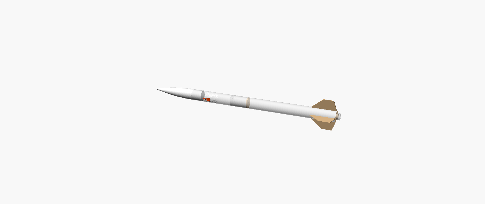

# ASTRA-66: modular student rocket airframe (CAD rev B)

[](https://github.com/Aarya801/ASTRA-66/actions/workflows/validation.yml)

> **NOT FLIGHT CERTIFIED. DRAFT STUDENT ENGINEERING DESIGN.**
> ASTRA-66 is not flight-ready. Propulsion is an **external, commercially certified component**. This repository does
> not design, modify or specify motors, propellants, igniters, explosives or pyrotechnics. All propulsion data here are
> **placeholders**. Any launch requires review and sign-off by a qualified rocketry mentor or institution and the range
> safety officer.



## Project overview

ASTRA-66 is a 66 mm-class, 1144 mm modular rocket airframe designed as a university student engineering project. It
covers four areas:
- **CAD:** a parametric OpenSCAD model.
- **Automated CAD validation:** mesh validity, interference, assembly feasibility, printability and mass properties.
- **Analysis:** non-propulsion engineering analysis (mass, CG, CP, stability, loads, recovery).
- **Simulation:** a transparent 1-DOF flight-simulation and sensitivity pipeline.

The engineering package ties them together with drawings, a BOM, a test plan and checklists. It is all reproducible
with one standard-library Python command.

## Engineering objectives

- **Stability:** static margin 1.5–3.0 calibres from rail exit to burnout (an engineering target, not a flight approval).
- **Modularity:** nose, payload bay, avionics bay and booster sections. The fins are replaceable: they slide in and are locked by a screwed ring, and can be removed with the commercial retainer fitted.
- **Low-cost manufacture:** FDM-printed parts, laser-cut plywood, purchased tube stock and metric fasteners.
- **Recovery:** single parachute sized for about 5 m/s descent. Deployment relies on the certified motor's own ejection, prepared by a mentor.
- **Avionics:** sensing, logging and telemetry only, with **no outputs that can drive any energetic device**.
- **Traceability:** every number is tagged with its provenance (calculated, assumption, user-supplied, commercial spec).

## CAD architecture

| Item | Location |
|---|---|
| Master parametric assembly | `cad/assembly/astra66_assembly.scad` (MODE = assembly / exploded / section) |
| Part sources | `cad/parts/` (25 parts + `COTS_envelopes.scad` for purchased items) |
| Derived stations and helpers | `cad/lib/astra66_core.scad` |
| Parameters (generated from `analysis/analysis.py`) | `cad/astra66_params.scad` |
| CAD pipeline (render → validate → export → mass hand-off → drawings) | `cad/build_cad.py` |
| Part registry, corrections log, remaining assumptions | `cad/cad_parts.py` |

One parameter source drives the CAD, the analysis and the documentation. Purchased and commercial items (motor
envelope, retainer, rail buttons, eyebolt, electronics) appear only as **envelopes**. Their final sizes must come from
the manufacturers' documentation.

## Simulation and validation workflow

```
analysis/analysis.py ──► build.py ──► cad/astra66_params.scad ──► cad/build_cad.py (OpenSCAD, optional)
        │                    │                                          │
        │                    └► engineering package, BOM, drawings      └► CAD validation + CAD-derived masses
        ▼
simulation/flight_simulation.py ──► stability, sensitivity, verification, plots, reports
        ▲
simulation/motor_config.json + simulation/motors/*.eng  (external motor data, currently PLACEHOLDER)
```

`python run_validation.py` runs seven steps and writes `documentation/ENGINEERING_STATUS.md`:
1. The package build.
2. A CAD currency check: the committed CAD validation must match every current `.scad` source and parameter.
3. The simulation pipeline.
4. The avionics sensor replay of the synthetic sample dataset.
5. The avionics CAD-fit and mass-properties check.
6. The regression tests (including `tests/test_avionics.py`).
7. The avionics software tests (hardware-free, SIMULATED data).

## Data classes: verified, calculated, assumed, placeholder

Every value in the reports belongs to one of four classes (defined in `documentation/CAD_VALIDATION.md` §5.4):

| Class | Meaning | Examples |
|---|---|---|
| **A: verified from CAD** | Measured from the rendered OpenSCAD meshes | lengths, stations, diameters, fin geometry, part volumes, clearances, interference |
| **B: calculated** | Computed from A, C and D values by the analysis and simulation code | CG, CP, static margin, loads, descent rate, part masses |
| **C: assumption** | Engineering estimate that must still be measured | material densities, print fill, electronics / recovery / paint / adhesive masses, allowables, drag model |
| **D: placeholder** | Stand-in until real data exist | motor and retainer data, camera, battery, switch, hardware and rail-button envelopes |

"Verified" here means verified against the CAD model or against closed-form checks. **No value has been verified by
physical measurement or flight test.** A calculated value is only as good as the assumptions and placeholders it uses.

## Key documented results

| Result | Value | Class |
|---|---|---|
| CAD validation | 147 PASS · 12 accepted WARN · 0 FAIL · 0 interferences | verified from CAD |
| Overall length / body OD / fin span | 1144 / 66 / 186 mm | verified from CAD |
| Liftoff mass / CG / CP | 1210.7 g / STA 696.4 mm / STA 870.3 mm | calculated (CAD-derived structural masses) |
| Static margin liftoff / rail exit / burnout | 2.63 / 2.67 / 2.92 cal | calculated, **depends on placeholder motor data** |
| Static margin without the motor | 3.23 cal | calculated; excludes the motor but **still includes the placeholder retainer mass and MMT geometry** |
| Trajectory (apogee 328 m, v_max 80 m/s, a_max 7.4 g) | illustrative only | **placeholder test input: not representative of any real motor** |
| Descent rate | 5.09 m/s | calculated; uses the placeholder burnout mass |

Full reports:
- `documentation/CAD_VALIDATION.md`
- `documentation/SIMULATION_VALIDATION.md`
- `documentation/ENGINEERING_STATUS.md`
- `simulation/results/stability_report.md`
- `simulation/results/sensitivity_report.md`

## Numerical verification: 13/13 checks pass

`simulation/verification.py` checks the simulation code against closed-form solutions and independent calculations:

1. ISA density at 0 m (ISO 2533).
2. ISA density at 11 000 m (ISO 2533).
3. ISA speed of sound at 0 m.
4. Thrust-curve impulse: fine numerical quadrature against the piecewise-analytic value.
5. Motor mass after burnout.
6. Burnout altitude for constant thrust and mass with no drag (closed form).
7. Apogee for the same case (closed form).
8. Landing descent rate against the parachute terminal velocity.
9. Apogee time-step convergence (dt halved).
10. Liftoff mass: simulation against the analysis.
11. Liftoff CG: simulation against the analysis.
12. CP: independent Barrowman on CAD-measured geometry against the analysis.
13. Drag coefficient within a stated plausibility band (an **assumption** band, not a measurement).

These verify the **software**. They do not validate the rocket's real flight behaviour; that requires the measurements and reviews below.

## CAD and drawing package

- **Print files:** `cad/exports/stl/` holds 15 print-ready STLs, already oriented, with support needs listed in `documentation/CAD_VALIDATION.md`.
- **Cut files:** `cad/exports/dxf/` holds 8 DXF + 8 SVG laser/knife-cut profiles (plywood bulkheads, rings, fins, gasket).
- **Assembly meshes:** `cad/exports/assembly/` holds the assembly and exploded STLs.
- **CAD drawings:** `cad/drawings/` holds 32 sheets made from true sections of the rendered meshes: 6 assembly/section sheets and one sheet per part, indexed in `cad/drawings/index.html`.
- **Engineering sheets:** `documentation/drawings/` holds sheets A-001…A-007 (general arrangement, exploded view, sections, fin, nose, avionics bay).
- **Full package:** `documentation/ASTRA-66_Engineering_Package.html` (also as a standalone page in `dist/index.html`).
- **Renders:** `images/` holds the assembly, exploded, half-section and vertical views.

## Parts and BOM

| File | Content |
|---|---|
| `bom/bom.csv` | 43 line items: 26 make, 15 buy, 2 EXTERNAL (certified motor and igniter: never fabricated) |
| `bom/fasteners.csv` | 17 metric fastener / heat-set insert types |
| `bom/materials.csv` | 10 stock materials |
| `avionics/electronics.csv` | electronics module classes (verify datasheets) |

Planning cost ranges, excluding motors, tools and shipping: **low-cost build USD 232–437**, **recommended build USD 292–636**.
These are assumptions; check local prices.

## Avionics and flight-data system (Phase 4)

Software architecture and simulation for sensing, data logging, telemetry, ground-station display and post-flight
analysis. **No avionics hardware has been selected, built or tested** (every sensor is COMPONENT TO BE SELECTED), all
avionics data are **SIMULATED**, and the avionics are **not flight certified**. They have no output that can drive an
igniter, pyrotechnic, energetic or deployment device; the flight state is a data label only.

| Layer | Location |
|---|---|
| Sensor layer (interfaces, requirements, simulated sensors) | `avionics/firmware/sensor_interfaces/` |
| Flight-data processing (Kalman filter, state classifier) | `avionics/firmware/flight_state/` |
| Data logger (schema validation, CSV / JSON-lines, CRC-16) | `avionics/firmware/logging/` |
| Telemetry (41-byte packet, simulated link, hardware interface) | `avionics/firmware/telemetry/` |
| Ground station (receiver, dashboard prototype) | `avionics/ground_station/` |
| Post-flight analysis (plots, statistics) | `avionics/analysis/flight_data_analysis.py` |
| Schema and SIMULATED example flight | `avionics/data/` |

Design: `documentation/AVIONICS_DESIGN.md`; architecture, data flow and interfaces: `avionics/architecture/`.
Phase 5 integration: audit and block diagram `documentation/AVIONICS_ARCHITECTURE.md`, hardware classes
`avionics/HARDWARE_MAPPING.md`, formats `avionics/DATA_FORMAT.md`, CAD fit and mass properties
`documentation/CAD_AVIONICS_INTEGRATION.md`, status `documentation/PHASE_5_STATUS.md`.
Phase 6 hardware-integration readiness: `documentation/HARDWARE_INTEGRATION_STATUS.md` (what is verified, assumed,
unverified, needs hardware or needs qualified review), `documentation/HARDWARE_SELECTION_CHECKLIST.md`,
`documentation/AVIONICS_BENCH_TEST_PLAN.md`, `documentation/MASS_MEASUREMENT_PROCEDURE.md` and the bench-record
template in `avionics/bench_data/`. Data-source modes SYNTHETIC / BENCH / FLIGHT are defined in
`avionics/firmware/data_source.py`; FLIGHT is disabled because no flight data exist.

```bash
python -m avionics.firmware.simulate_flight
python avionics/analysis/flight_data_analysis.py avionics/data/example/example_flight_simulated.csv
python avionics/ground_station/server.py --simulate
python simulation/avionics_replay.py          # replay the synthetic sensor dataset simulation/data/sample_flight.csv
```

## Manufacturing considerations

- **Printing:** PETG and ASA on an FDM printer with at least a 220 × 220 × 250 mm build volume.
  - ASA is used for the fin-can core near the motor.
  - 11 printed parts need support material in the documented pose.
  - The hatch panel wall is 1.0 mm; a 0.25 mm nozzle is recommended.
- **Laser cutting:** plywood bulkheads, rings and fins are cut from the DXF files. The tubes are cut from purchased stock.
- **Fits:** print fit coupons (shoulder, fin-guide slot, heat-set inserts) before the real parts. Fit clearances are named parameters.
- **Dimensions:** tube, coupler and motor-tube dimensions are nominal. Measure the purchased stock and re-run the pipeline.
- **Full plan:** tolerances, the assembly procedure and the test plan are in the engineering package (§7.10, §10–§12).

## Known limitations

- **Propulsion data are placeholders.** All trajectory values, and every static margin that includes the motor, are provisional.
- **Rail exit:** rail-exit speed is 11.7 m/s on the 1.0 m planning rail, below the 15 m/s guideline (placeholder input).
- **Payload limit:** more than about 100 g extra in the payload bay pushes the margin above 3.0 cal (over-stable).
- **Drag model:** an uncalibrated component build-up (assumption).
- **Flight model:** vertical 1-DOF only; no wind, weathercocking, angle of attack or dynamic-stability analysis.
- **Structures:** hand calculations with conservative allowables only; no FEA and no coupon test data.
- **Printability:** judged by a 45° overhang rule only; not yet checked in a slicer.
- **Placeholder sizes:** camera, battery, switch, insert, tee-nut, rail-button, eyebolt and retainer sizes, the rail length and the launch site are placeholders.
- **Reports:** generated reports carry their run date; the numbers are deterministic.
- **Avionics:** software and simulation only; no component selected; state thresholds and filter tuning are assumptions checked against simulated data only.

## Placeholder propulsion data

`simulation/motor_config.json` has `"status": "PLACEHOLDER"`. The thrust curve
`simulation/motors/PLACEHOLDER_TEST_INPUT.eng` is a **synthetic test signal: not a real motor, not a product and not
performance data**. No apogee, altitude, velocity, acceleration or rail-exit value in this repository is representative
of a real motor.

When a mentor has selected a legally obtainable certified motor, its **published** data and official `.eng` file go into
that configuration (`"status": "MANUFACTURER_DATA"`), with source, verifier and date recorded. The code refuses
incomplete or inconsistent motor data. See `simulation/README.md`.

## Physical measurements still required

- Tube, coupler and motor-mount-tube diameters (3 stations × 2 axes).
- The mass of every part and module.
- The CG with the actual motor installed.
- Printed fit coupons and fin alignment (cant and spacing).
- The separation force at the avionics-to-booster joint.
- A recovery static proof load and a parachute drop test (descent rate).
- The camera field of view through the 14 mm hole, and battery endurance on the pad.
- Cross-checks of drag, CP and trajectory in OpenRocket / RASAero.

## Mentor and range review requirements

- Selection of a legally obtainable certified motor. Motor preparation and handling are done by a certified person only.
- Ejection-delay choice from the manufacturer's options, using the simulated coast time.
- Static margin with the real motor and a measured CG. Rail-exit speed on the range's rail.
- Retainer installation, recovery hardware ratings and proof loads, and fin and rail alignment inspection.
- The complete flight-readiness review and range safety officer approval on the day.

## NOT FLIGHT CERTIFIED

This is a draft student engineering, CAD and simulation portfolio project. It is **not flight certified** and **not
flight-ready**, and nothing in this repository is a substitute for qualified review. The authors accept no
responsibility for any use of this design. See `LICENSE`.

## Repository structure

```
ASTRA-66/
├── README.md, LICENSE, run_validation.py, build.py, requirements.txt
├── MANIFEST.sha256    SHA-256 of every tracked file (with .gitattributes keeping files byte-identical)
├── .github/workflows/validation.yml   CI: runs run_validation.py on every push / pull request
├── analysis/          analysis.py (source) + results/ (generated)
├── cad/
│   ├── assembly/      astra66_assembly.scad (master assembly)
│   ├── parts/         one .scad per part + COTS_envelopes.scad
│   ├── lib/           astra66_core.scad
│   ├── drawings/      CAD drawings (generated) + index.html
│   ├── exports/       stl/, dxf/, assembly/, mass + validation JSON (generated)
│   ├── cadtools/      mesh analysis + drawing helpers
│   └── build_cad.py, cad_parts.py, astra66_params.scad, astra66.scad
├── simulation/        flight simulation, stability, sensitivity, verification, configs, results/, plots/
├── avionics/          electronics.csv + diagrams/ (generated); Phase 4: architecture/, firmware/, data/,
│                      ground_station/, analysis/, tests/ (flight-data software, SIMULATED data only)
├── bom/               bom.csv, fasteners.csv, materials.csv
├── documentation/     engineering package HTML, validation reports, engineering status, drawings/, generator/, baseline/
├── images/            OpenSCAD renders
├── tests/             regression tests (package, CAD, simulation, documentation)
├── hosting/           make_standalone.py → dist/index.html
├── dist/              standalone engineering-package page
└── tools/             optional helper scripts (OpenSCAD render check)
```

## Setup

- **Python:** 3.12 or newer (tested with 3.12 and 3.14). Standard library only; `requirements.txt` lists no packages, so
  there is nothing to install. Clone the repository and run the commands below from its root.
- **Viewing the package:** open `documentation/ASTRA-66_Engineering_Package.html` or `dist/index.html` in a browser, or
  serve the folder locally with `python -m http.server 8766 --bind 127.0.0.1`. The page loads web fonts from Google Fonts
  and falls back to system fonts when offline. It makes no other network requests.
- **OpenSCAD (optional):** only needed to regenerate the CAD outputs. Install OpenSCAD 2021.01 from openscad.org; it is
  not bundled. Pass `--openscad <path>` or set the `OPENSCAD` environment variable. The CAD pipeline works in
  `<temp>/astra66_cad` (OpenSCAD 2021 cannot open paths longer than 260 characters on Windows); override that folder
  with `ASTRA66_CAD_WORK`. These two optional tool-path variables are the only environment variables the project reads;
  there are no API keys, accounts or secrets.

## How to run the validation

```bash
python run_validation.py
```

Expected ending: `OVERALL: PASS` (exit code 0) with:
- engineering package build: PASS;
- CAD integration: PASS;
- flight simulation (`verification 13/13 passed`): PASS;
- avionics sensor replay and CAD-fit / mass-properties check: PASS (the check reports 4 WARN and 8 UNVERIFIED items,
  none FAIL; see `documentation/CAD_AVIONICS_INTEGRATION.md`);
- regression tests (74 tests): PASS;
- avionics software tests (81 tests): PASS.

No hardware has been selected, built, weighed or tested: `documentation/HARDWARE_INTEGRATION_STATUS.md` lists what is
verified by software and what still needs a bench or a qualified review.

Optional full CAD regeneration uses OpenSCAD 2021.01 from openscad.org, which is not bundled:

```bash
python run_validation.py --with-cad --openscad "C:/path/to/openscad.com"
```

Other commands: `python build.py` (package only), `python simulation/flight_simulation.py` (simulation only),
`python -m unittest discover -s tests -v` (tests only), `python -m unittest discover -s avionics/tests -t .` (avionics
tests only), `python hosting/make_standalone.py` (standalone page).

## Future improvements

- **Certified motor:** enter the certified motor's published data and re-validate (next engineering phase, with a mentor).
- **Measured masses:** replace every assumed or placeholder mass and dimension with measured values.
- **Cross-checks:** OpenRocket / RASAero comparison of drag, CP and trajectory.
- **Structures:** FEA of the fin can and bulkheads; tensile coupon tests of printed parts and bonds.
- **Printability:** check in a slicer for supports, bridging and first-layer area.
- **Flight model:** a wind / weathercocking-capable model once measured data exist.
- **Avionics hardware:** select components with a mentor, port the Phase 4 software to the microcontroller, bench-test
  sensors, logging and telemetry, and compare with the simulation (`documentation/AVIONICS_DESIGN.md` §12).

## License

Code and documentation are released under the MIT License (`LICENSE`). The license's "AS IS" warranty disclaimer
applies. The project safety notice in `LICENSE` and this README must be kept with any copy.
