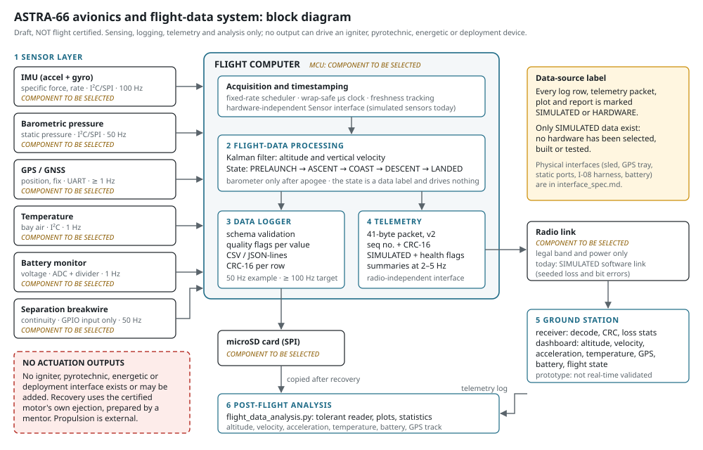

# ASTRA-66 avionics: system architecture

> **Draft student design. The avionics are NOT flight certified.** No component has been selected, built or tested.
> Everything described here runs in software against **SIMULATED** sensors. The avionics sense, log and transmit data
> only: they have **no output that can drive an igniter, pyrotechnic, energetic or deployment device**, and none may be
> added. Propulsion is an external, commercially certified component; recovery uses the certified motor's own ejection,
> prepared by a mentor.

## 1. Layers

| # | Layer | Responsibility | Code | Status |
|---|---|---|---|---|
| 1 | SENSOR LAYER | Hardware-independent `Sensor` interface; fixed-rate sampling; simulated sensors with fault injection | `avionics/firmware/sensor_interfaces/` | Implemented (simulated only) |
| 2 | FLIGHT-DATA PROCESSING | Pad reference, pressure → altitude, Kalman filter (altitude, vertical velocity), flight-state classifier | `avionics/firmware/flight_state/` | Implemented |
| 3 | DATA LOGGER | Schema validation, timestamp checks, quality flags, CSV / JSON-lines writers with CRC-16, tolerant reader | `avionics/firmware/logging/` | Implemented (file sink; SD driver not selected) |
| 4 | TELEMETRY | 41-byte packet v2 (sensor-health bits since Phase 5), simulated link, hardware-link interface | `avionics/firmware/telemetry/` | Simulated link implemented; hardware link = interface only |
| 5 | GROUND-STATION VISUALIZATION | Receiver with link statistics, local server, browser dashboard | `avionics/ground_station/` | Prototype (simulated / replayed data) |
| 6 | POST-FLIGHT ANALYSIS | Log reader, plots, derived statistics, report | `avionics/analysis/` | Implemented |

`avionics/firmware/flight_computer.py` is the main loop that joins layers 1–4. `avionics/firmware/simulate_flight.py`
runs it against simulated sensors and produces the example dataset.

## 2. Design principles

1. **Sensing is decoupled from everything hazardous.** The flight state is a label in the data. No layer has an output
   port, GPIO write, actuator driver or command path. A test (`avionics/tests/test_architecture.py`) fails if an
   actuation-type identifier or a hardware-I/O library appears anywhere in the avionics code.
2. **Hardware independence.** Each layer talks to an interface (`Sensor`, `LogSink`, `TelemetryLink`). A selected
   component will get a driver behind the same interface; nothing above it changes.
3. **Simulated and real data can never be confused.** Every log row (`data_source`), telemetry packet (SIMULATED flag),
   plot and report carries its source. The logger refuses a frame whose source differs from its own, and the flight
   computer refuses to log simulated sensors as HARDWARE.
4. **Never lose data silently.** Invalid values become empty and are flagged in `quality_flags`; rejected frames are
   counted in the log metadata; the reader reports every dropped row and why.
5. **One schema.** `avionics/data/schema/flight_data_schema.json` defines fields, units, rates and plausibility limits,
   and drives validation, CSV formatting and parsing.
6. **Standard library only**, like the rest of ASTRA-66, so the complete chain runs in CI without hardware.

## 3. Flight computer loop (per tick, base rate 100 Hz)

1. Poll every sensor that is due (IMU 100 Hz, barometer 50 Hz, separation 50 Hz, GNSS / temperature / battery 1 Hz).
2. Accelerometer sample → Kalman prediction; barometer sample → altitude above the pad → Kalman update.
3. Classifier update (PRELAUNCH → ASCENT → COAST → DESCENT → LANDED). After apogee the estimator ignores the
   accelerometer (the bay orientation under the parachute is unknown).
4. Every log period (50 Hz in the example): build a frame from the samples taken since the last frame, validate, write.
5. Every telemetry period (5 Hz): encode a summary packet from the latest values and hand it to the link.

## 4. What is verified and what is not

| Item | Status |
|---|---|
| Software behaviour (validation, timestamps, faults, states, packets, logging, analysis) | Tested with 81 hardware-free tests on simulated data |
| State-transition thresholds | **Assumptions**, checked against the PLACEHOLDER trajectory only; must be re-checked with the certified motor's data and bench / flight data |
| Sensor ranges and rates | **Requirements** (class C); no component selected |
| Timing on a real microcontroller, SD write speed, radio range, power budget | **Not assessed**: needs hardware |
| Real-time ground-station performance | **Not validated** |

See `interface_spec.md` for every interface and `data_flow.md` for the data path.
